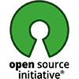

# D-Insight Code Bank  

The [TIS Lab at EPFL](https://tis.epfl.ch) distributes the [D-Insight Code Bank](https://github.com/d-insight/code-bank/) under an open [MIT License](https://opensource.org/licenses/MIT). You may access, download, clone, edit, reuse, and collaborate on these materials without restriction.  

   

## Overview

The Code Bank is organized into the following folders. All code is ready for execution, with the exception that code in the **_beta/** directory is still in review and testing.

   * __Illustrations__  

      Illustrations are short portions of programming code to demonstrate a concept covered in a lecture. Each illustration may take 5 to 10 minutes to complete. The emphasis when showing an illustrations is not on the code, syntax, or libraries used - but rather on the concepts that are being taught. When showing an illustration, the idea is to jump over the code and show the result(s) of what the code does.

   * __Demos__  

      Demonstrations cover a topic in more depth than an illustration; here, there is more emphasis on the code, syntax, and libraries that are being used. Each demo generally takes 45 to 90 minutes to complete. The emphasis in a demo is to walk the students through an extended example, going step-by-step, so they see a complete example of solving a particular problem.  

   * __Exercises__  

      Exercises require students to solve short problems on their own. Exercises do not require long logical chains to complete. The emphasis of an exercise is to push students to look through other code that they have covered elsewhere in DSFM (say in Demos and Illustrations) in order to find snippets of code that they can re-purpose to solve a new problem.

  * __Projects__  

      Projects asks students to work through an entire Data Science application. Projects do not require students to program all of it (doing so would not be feasible during the available time in boot camp courses); rather, projects focus attention on discrete portions of code to be completed, while the missing piece is embedded within a longer chain/logical progression of code. 

       

## Installation & Execution

1. Install Python 3.7.

    Download and install [Anaconda Python 3.7](https://www.anaconda.com/download/).

2. Clone the Code Bank.

    `git clone https://github.com/KenYounge/data-science-code-bank.git`
    
3. Install the Python [requirements](REQUIREMENTS.txt).

    `cd code-bank`
    
    `pip install -r REQUIREMENTS.txt`  

4. Execute

      Most of the code in the __Code Bank__ runs in [Jupyter Lab](https://jupyter.org/) notebooks. Most notebooks can be run locally (or remotely) on a standard computer with Python 3.x and a basic Anaconda Data Science environment ([see requirements](REQUIREMENTS.txt)). A few advanced examples, however, may require additional memory, processors, GPUs/TCUs, a Spark cluster, or other resources to run. If additional resources are required, it should be noted in the file. 

      We often recommend that students use a virtual machine (VM) to run their code. We provide an additional `readme` file in the __vms/__ to help you set up a VM on the [Google Compute Platform](https://cloud.google.com/).

