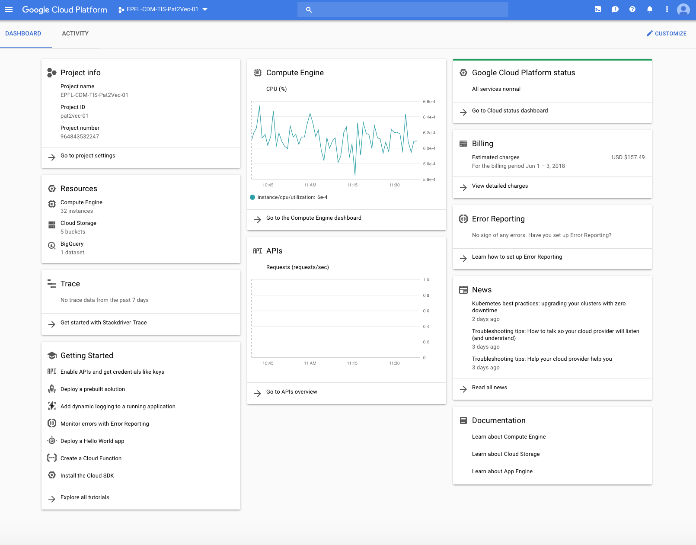
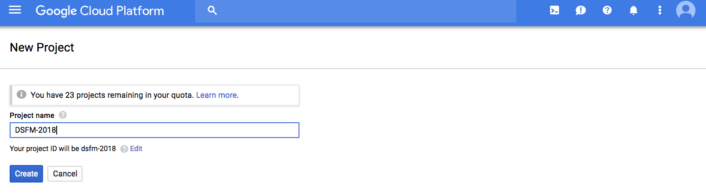
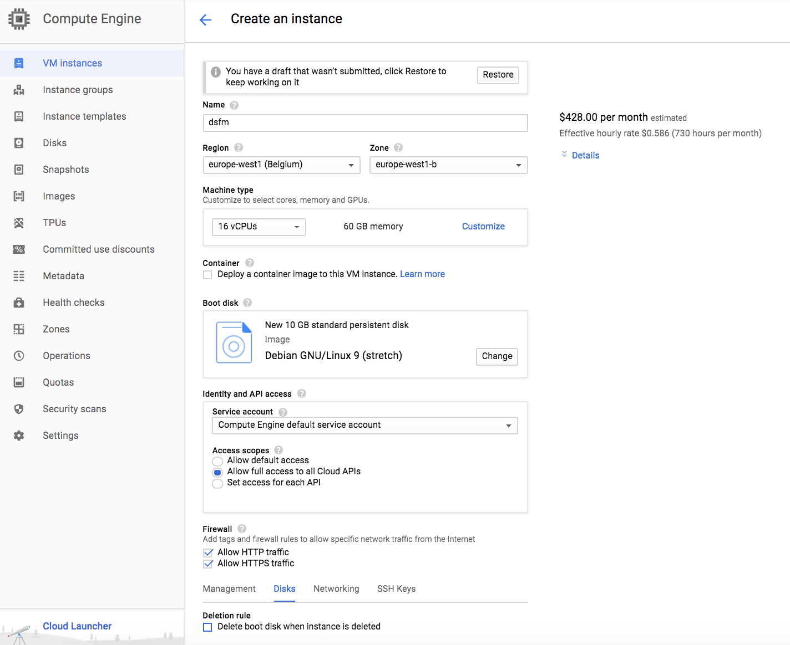

# Virtual Machines

### Google Cloud

You can use the DSFM Code Bank on any computer with the requirements installed, as described above. Many students, however, prefer to use a virtual machine to run the code on a remote computer that is more powerful than their local computer. Virtual Machines may also be started, stopped, and backed-up remotely - as needed. You can use any virtual machine that can host a Jupyter Server interface; however, we typically use a VM on the Google Cloud Platform.

Follow the instructions below to setup your own virtual machine at Google. Google now also offers ready-to-go VMs for data science projects - you can use a preconfigured machine if it meets your needs. The follow instructions are helpful if you want to set up a particular type of machine for your project.

#### Step 1: Create an account.  

Start a [Google Cloud Platform](https://cloud.google.com/) (GCP) account and log into your console.

#### Step 2: Create a project.  

From the main dashboard, create a new GCP project.

#### Step 3: Start a virtual machine.

Create a new virtual machine (VM) by clicking on **Main Menu -> Compute Engine -> VM instances** and Create a new instance. Configure the location, hardware specifications (CPU / GPU, RAM, Hard Disk), Operating System, and other settings of the machine when you create it. The price of the machine per month is displayed on the right panel.

#### Step 4: Create a static IP address.

You will want to set an static external IP address for your VM so that you can always access it at that address (reserving a static IP, however, does cost more). To do so, click on the **VPC network -> External IP addresses** from the main console menu. Once you have reserved a static address, you will then need to connect it to the virtual machine "instance" that you created earlier by selecting the VM under "Attach to." 

#### Step 5: Configure the firewall.

By default, external traffic to your virtual machine will be blocked, so you will need to enable external access to your instance through port 5000 and the TCP protocol.

To enable such access, click on the **VPC network -> Firewall rules** from the main console menu, click on **Create** a firewall rule, and fill out the red parts as shown.
 

 
#### Step 6: Start your VM and login with SSH.

Select your machine from **Main Menu -> Compute Engine -> VM instances** and start it. Once it is up and running, you can then access the VM through an SSH terminal by clicking on the SSH option listed with the machine.

#### Step 7: Install Anaconda Python 3.7.

As your VM is probably running Linux, you may need to install Anaconda Python manually. The following instructions worked for us 
	
	apt-get update
	apt-get upgrade
	apt-get install git
	
	sudo su
	wget https://repo.continuum.io/archive/Anaconda3-5.2.0-Linux-x86_64.sh
	apt-get install bzip2
	bash Anaconda3-5.2.0-Linux-x86_64.sh
	source /root/.bashrc
	
	pip install -r requirements.txt
	
	pip install google-compute-engine --ignore-installed      # required for proper installation of gensim
	conda install -c conda-forge gensim 
	conda install -c conda-forge tensorflow                   # install before keras as default backend
	conda install -c conda-forge keras
	apt-get install graphviz                                  # needed for keras model visualization
	conda install -c conda-forge xgboost 
	conda install -c conda-forge plotly 
	conda install -c conda-forge networkx
	conda install -c conda-forge lightgbm
	conda install -c conda-forge textblob
	conda install -c conda-forge scikit-optimize
	conda install -c conda-forge scrapy
	conda install -c conda-forge nodejs
	conda install -c conda-forge pydot 
	conda install -c conda-forge basemap
	conda install -c conda-forge folium  
	conda install -c conda-forge spacy 
	conda install -c conda-forge scikit-image
	conda install -c conda-forge wordcloud
	apt-get install enchant
	pip install pyenchant
	apt-get install unzip  

### Step 8: Setup Jupyter Lab server

Convert your virtual machine to a Jupyter Lab server to access it remotely. First generate a configuration file using:

**`jupyter notebook --generate-config`**
 
Next open the configuration file with your favourite editor (e.g. *vim*):

**`vim /root/.jupyter/jupyter_notebook_config.py`**

Add the following four lines in the jupyter_notebook_config.py file:

	c = get_config()
	c.NotebookApp.ip = '*'
	c.NotebookApp.open_browser = False
	c.NotebookApp.port = 5000

Install any of the Jupyter Lab extensions that you think you will use. For example:

**`jupyter labextension install jupyterlab_bokeh`** 

Run the Jupyter Lab server using the following command:

**`jupyter lab`**

This will run a Jupyter Lab server on the earlier specified port (e.g. 5000) so you can access it remotely.

### Step 9: Connect to your Jupyter Lab server

Copy the link printed by the console after starting the Jupyter Lab server (where it says "Login with a token:") and past it into the URL Address box on your web browser. 

### Step 10: Clone the DSFM Code Bank

In Jupyter Lab, open a new Linux Terminal: **File -> New -> Terminal**

Then clone the repository by executing the following command into the terminal:

`git clone https://github.com/dsfm-org/code-bank.git`

### Done! You're ready to goet started with your VM.
